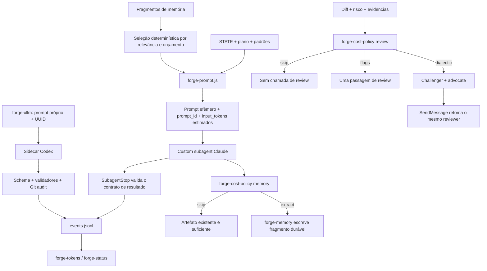

# Otimização de custo e consumo de contexto

Este documento descreve como o Forge reduz consumo desnecessário de tokens sem enfraquecer os gates de segurança que realmente importam. O princípio central é simples: decisões determinísticas ficam em scripts; modelos recebem apenas o contexto relevante; chamadas caras são reservadas para mudanças de maior risco; e cada dispatch ganha identidade e telemetria próprias.

Não há promessa de economia percentual neste documento. O Forge usa `chars / 4` como estimativa local de tokens para prompts e respostas. Essa heurística é útil para comparar execuções e detectar regressões, mas não substitui a contagem nem o custo reportados pelo provedor.

## Arquitetura do fluxo econômico

O desenho atua sobre quatro fontes de custo diferentes:

1. **Contexto do orquestrador:** evita carregar templates extensos, o monólito inteiro de memória e conteúdo que pertence apenas ao worker.
2. **Entrada do worker:** seleciona memória e seções de padrões sob orçamento explícito.
3. **Quantidade de chamadas:** evita review dialético e extração de memória quando uma política determinística conclui que não agregariam valor proporcional.
4. **Repetição dentro da chamada:** retoma o mesmo reviewer e limita turnos máximos dos subagentes.

## Melhorias implementadas

### Montagem determinística de prompts

`scripts/forge-prompt.js` centraliza a montagem de prompts de dispatch. Ele:

- resolve templates locais do projeto antes das cópias instaladas ou globais, evitando divergência entre o checkout e o runtime;
- suporta as unidades `execute-task`, `execute-loose-task`, `plan-slice`, `plan-check`, `plan-milestone`, `complete-slice`, `complete-milestone`, `discuss-*` e `research-*`;
- valida tipo de unidade, IDs, placeholders, limites de tamanho e caminhos;
- extrai somente as seções necessárias de `CODING-STANDARDS.md`, em vez de injetar o arquivo inteiro indiscriminadamente;
- pede à API de memória apenas fatos relevantes, com limite de entradas e orçamento de tokens;
- injeta o cabeçalho de isolamento para `branch` e `worktree` sem mover `.gsd/**` para o diretório de código;
- grava atomicamente o artefato em `.gsd/forge/prompts/<prompt_id>.md`, com permissão restrita quando suportada;
- registra no frontmatter a origem e o hash do template, o tipo/unidade, o `prompt_id` estável, aliases de compatibilidade e a estimativa de `input_tokens`;
- remove exatamente um artefato por `dispatch_id` com `--cleanup`, validando que o alvo permaneça dentro do diretório de prompts.

O ganho arquitetural aparece quando o orquestrador passa ao subagente Claude apenas uma instrução curta para ler o prompt materializado. Assim, o corpo completo pertence ao contexto isolado do worker e não precisa atravessar o contexto principal como texto repetido. O sidecar Codex ainda monta seu próprio prompt validado em `forge-xllm.js`; unificar os dois corpos é uma evolução futura, não uma capacidade já entregue.

Cuidados operacionais:

- o artefato é efêmero e deve ser removido em um bloco equivalente a `finally`, tanto em sucesso quanto em falha;
- `.gsd/forge/prompts/` integra a lista canônica de arquivos locais ignorados pelo VCS, reduzindo o risco de um prompt órfão ser commitado após crash; o ignore não substitui o cleanup;
- `input_tokens` usa a heurística `chars / 4`, indicada pelo campo `token_method`; não é uma fatura do provedor;
- o conteúdo do prompt ainda conta como entrada do worker. A economia principal é impedir duplicação no orquestrador e reduzir o material selecionado, não tornar o prompt gratuito;
- templates locais são código de execução: devem passar por revisão e não devem aceitar placeholders desconhecidos.

### Memória seletiva e identidade lógica

`scripts/forge-memory.js --query|--select` e `scripts/forge-projection.js` substituem a leitura integral de `AUTO-MEMORY.md` no hot path por seleção determinística. A consulta considera:

- termos da unidade, plano ou descrição;
- categoria preferida conforme o tipo de unidade;
- confiança, hits e decay já mantidos pelo fragment store;
- limite de entradas;
- orçamento máximo estimado por `chars / 4`;
- ordenação estável para a mesma entrada.

O resultado pode ser JSON ou Markdown. O CLI oferece `--query-file`, preferível a transportar planos longos em `argv`, especialmente no Windows. A identidade lógica usa `(unit_id, mem_id)`, de modo que memórias diferentes dentro dos fragmentos carregados não se sobrescrevem. IDs canônicos de slice e task (`S##` e `T##`) são aceitos. Limitação atual: como o nome físico do fragmento ainda usa o ID local, um mesmo `T##` em milestones diferentes precisa futuramente de uma chave globalmente qualificada para eliminar toda colisão entre milestones.

Seleção reduz contexto, mas não deve ocultar conhecimento obrigatório. Regras normativas e decisões vinculantes continuam nos artefatos canônicos da unidade; memória emergente é complemento ranqueado. Para investigação humana, `AUTO-MEMORY.md` pode continuar existindo como projeção legível, mas não precisa ser a fonte runtime.

### Política adaptativa de review

`scripts/forge-cost-policy.js review` decide de forma determinística entre `skip`, `flags` e `dialectic`. A política lê preferências e o `numstat` do diff, sem pedir a um modelo que decida se outro modelo deve ser chamado.

No modo adaptativo:

- diff vazio ou review desativado resulta em `skip`;
- mudança somente documental resulta em `skip`;
- mudança comum ou somente de testes usa `flags`, uma passagem de review;
- risco `high`/`critical`, checklist de segurança, drift de verificação, caminhos sensíveis ou diff acima do limiar configurado preservam o review dialético;
- `review.trigger: always` respeita explicitamente o estilo configurado;
- `review.style: flags` permanece uma escolha explícita do operador.

A saída inclui motivo, arquivos e linhas alterados, sinais de risco, chamadas estimadas e `saved_calls_vs_dialectic`. Esses campos devem ser gravados em um evento `review-policy`. “Chamadas poupadas” é uma diferença estrutural entre branches da política, não uma estimativa monetária ou de tokens.

A política é conservadora por design: autenticação, segurança, criptografia, permissões, pagamentos, migrations, schemas, infraestrutura, deploy e workflows de CI são tratados como caminhos sensíveis. Um erro ao coletar o diff não deve ser reinterpretado como autorização para pular um gate importante.

### Política adaptativa de extração de memória

`scripts/forge-cost-policy.js memory` evita executar `forge-memory` depois de toda unidade sem distinção:

- `memory.extraction: disabled` nunca extrai;
- `memory.extraction: always` mantém o comportamento integral;
- em `adaptive`, boundaries `complete-slice` e `complete-milestone` extraem porque consolidam conhecimento;
- `execute-task` extrai quando o resultado contém sinal durável, como decisão, gotcha, workaround, padrão, restrição ou causa raiz;
- planejamento, pesquisa e discussão podem pular a chamada quando o próprio artefato já é o registro canônico do conhecimento.

Essa regra reduz chamadas Haiku de baixo valor sem transformar um classificador LLM em pré-requisito. Como a detecção de sinal é lexical, falso negativo relevante deve ser corrigido refinando a lista de sinais ou usando `always` no projeto, não removendo a persistência canônica de decisões.

### Telemetria por dispatch

Cada chamada real ao modelo carrega um `dispatch_id` globalmente único. No caminho Claude, o artefato tem um `prompt_id` estável e aleatório, reutilizável pelo grupo de retries; cada chamada deriva dele um `dispatch_id` distinto. No sidecar, um UUID é persistido no estado, heartbeat, resultado e evento. `scripts/forge-tokens.js` deduplica por `dispatch_id`.

Para dados legados sem ID, a compatibilidade é conservadora: linhas usadas apenas no join histórico por timestamp/unidade podem ser deduplicadas, enquanto eventos canonicamente atribuídos a uma milestone continuam contados para não apagar tentativas legítimas sem identidade moderna.

A atribuição por milestone prefere o campo canônico `dispatch.milestone` no log global. O join com log por milestone fica restrito a linhas legadas sem discriminador; uma linha explicitamente atribuída a outra milestone nunca é incorporada por coincidência de timestamp ou unidade. Tentativas distintas no mesmo segundo continuam distintas quando têm `dispatch_id` diferente.

Para contar respostas extensas, `--scalar` lê `stdin` e retorna apenas o inteiro. Isso evita limites de command line e quoting de conteúdo em `argv`. O modo `--inline` permanece adequado somente para texto pequeno.

A telemetria local responde “quanto contexto o Forge estima que montou e recebeu?”. Para custo real e cache, use também os sinais do Claude Code ou OpenTelemetry descritos abaixo.

### Reparação do contrato com `SubagentStop`

O hook `SubagentStop` valida workers Forge que devem retornar `---GSD-WORKER-RESULT---`. Quando o marcador falta, o hook devolve `decision: block` com feedback, fazendo o mesmo subagente corrigir sua saída antes que o orquestrador a aceite. Isso reduz retries completos e evita interpretar uma narrativa como resultado estruturado.

O hook é deliberadamente limitado:

- agentes desconhecidos ou customizados não são interceptados;
- `forge-memory` não exige o bloco, pois seu contrato é o fragmento persistido pelo CLI;
- quando `stop_hook_active` indica a continuação causada pelo próprio hook, a validação falha aberta para impedir loop infinito;
- o mecanismo valida presença do contrato, não a verdade semântica de cada alegação. Verificação por Git, must-haves e testes continua necessária.

O comportamento de bloquear a parada e devolver feedback ao agente é uma capacidade nativa dos [hooks do Claude Code](https://code.claude.com/docs/en/hooks).

### Reuso do reviewer com `SendMessage`

No review dialético com challenger Claude, o Forge captura o `agent_id` retornado pelo primeiro `forge-reviewer`. Nas rodadas de rebuttal, `SendMessage` retoma esse reviewer com o histórico preservado. Assim não é necessário reenviar o diff e as objeções nem pagar novamente pela leitura inicial a cada rodada.

O fluxo mantém compatibilidade: sem `agent_id`, sem a tool ou em erro de envio, registra `review-resume-fallback` e usa um novo `Agent`. O review permanece advisory e não bloqueia a entrega por indisponibilidade do mecanismo. Atualmente o Claude Code só expõe `SendMessage` quando `CLAUDE_CODE_EXPERIMENTAL_AGENT_TEAMS=1`; o Forge não ativa esse recurso experimental automaticamente. Sem a flag, o fallback é o comportamento normal. Consulte a documentação de [subagentes](https://code.claude.com/docs/en/sub-agents).

### Limite nativo de turnos dos agentes

Os arquivos em `agents/` agora declaram `maxTurns` conforme o papel. Agentes de leitura curta têm teto menor; executores e completers recebem espaço maior. O limite nativo reduz loops acidentais, exploração sem fim e uso de tools além do necessário.

`maxTurns` não é um limite de tokens nem garante conclusão. Ao atingi-lo, o agente pode parar sem terminar o contrato; por isso o `SubagentStop`, os result blocks, checkpoints e retries tipados continuam necessários. A configuração e os campos suportados por custom subagents estão na documentação oficial de [subagentes](https://code.claude.com/docs/en/sub-agents).

## Recursos nativos úteis no fluxo interativo

Os comandos abaixo são operacionais: ajudam o humano a observar ou corrigir uma sessão, mas não devem ser simulados pelo Forge a cada unidade.

| Comando | Uso recomendado no Forge | Limite ou cautela |
|---|---|---|
| `/usage` | Consultar uso e limites da conta/sessão quando o backend disponibiliza esses dados. | Não fornece atribuição confiável por dispatch do Forge e pode variar conforme autenticação/plano. |
| `/context` | Inspecionar visualmente o que ocupa a janela antes ou durante um `forge-auto`. | É diagnóstico da sessão atual, não telemetria persistente por unidade. |
| `/compact [instruções]` | Compactar deliberadamente quando o contexto principal se aproxima do limite, preservando instruções de retomada. | Compaction é lossy; o Forge deve continuar reconstruindo estado de `.gsd/**`, não depender de variáveis conversacionais. |
| `/clear` | Iniciar uma sessão limpa entre trabalhos sem relação. | Descarta o contexto conversacional; só é seguro quando estado e checkpoints necessários já estão em disco. |
| `/doctor` | Diagnosticar instalação, configuração e integrações do Claude Code. | Complementa `/forge-doctor`; cada um verifica uma camada diferente. |
| `/memory` | Revisar arquivos de memória/instruções carregados pelo Claude Code. | Não substitui o fragment store nem a seleção runtime do Forge. |
| `/mcp` | Inspecionar servidores, estado e autenticação MCP. | MCPs grandes também consomem contexto de tool definitions; habilite apenas os necessários ao projeto. |
| `/skills` | Conferir skills disponíveis e detectar instalação duplicada ou ausente. | Invocar uma skill carrega suas instruções no contexto; não use uma skill apenas para descobrir algo que um script já sabe. |
| `/tasks` | Acompanhar e gerenciar tarefas em background. | Não confundir background tasks com workers GSD concluídos nem com `dispatch_id`. |

Veja a lista e o comportamento dos comandos em [modo interativo](https://code.claude.com/docs/en/interactive-mode), a documentação de [memória](https://code.claude.com/docs/en/memory), [MCP](https://code.claude.com/docs/en/mcp) e [skills](https://code.claude.com/docs/en/slash-commands).

## Controles úteis em execução headless

Se o Forge vier a chamar `claude` como um processo headless separado, os limites abaixo devem ser passados por esse adaptador como array de argumentos, nunca montados como uma string de shell. Eles não se aplicam automaticamente ao `Agent()` nativo nem ao sidecar Codex atual; hoje o controle integrado equivalente é principalmente `maxTurns` no frontmatter dos custom subagents.

| Flag | Aplicação possível | Cautela |
|---|---|---|
| `--max-turns <n>` | Teto por execução headless, equivalente em intenção ao `maxTurns` dos agentes. | Pode encerrar antes do result block; tratar como falha tipada, não como sucesso parcial silencioso. |
| `--max-budget-usd <valor>` | Circuit breaker monetário em execução API/headless suportada. | É controle de gasto real do caminho headless, não estimativa do `forge-tokens`; confirme compatibilidade com o modo de autenticação usado. |
| `--json-schema <schema>` | Exigir saída estruturada na fronteira do processo. | O schema não valida efeitos no filesystem nem substitui Git/must-haves. |
| `--tools <lista>` | Disponibilizar somente o conjunto de tools necessário à unidade. | Uma allowlist estreita pode quebrar workers existentes; derive por papel e teste cada agente. |
| `--disallowedTools <lista>` | Negar tools perigosas ou desnecessárias mesmo que estejam disponíveis por outra configuração. | Prefira negação explícita para operações incompatíveis com agentes read-only. |
| `--strict-mcp-config` | Usar apenas os MCPs fornecidos pela configuração explícita da execução. | Requer listar todos os MCPs necessários; um servidor omitido deixa de existir para o worker. |

As opções e suas restrições de modo estão na [referência oficial da CLI](https://code.claude.com/docs/en/cli-reference). Antes de criar um adapter Claude headless, faça testes de compatibilidade com autenticação por assinatura, API e setup-token: os mecanismos de contabilização e os campos disponíveis não são idênticos.

## OpenTelemetry e custo real

O Claude Code pode exportar métricas via OpenTelemetry, incluindo telemetria de uso de tokens e custo quando o ambiente e o backend fornecem esses dados. A configuração oficial está em [monitoramento de uso](https://code.claude.com/docs/en/monitoring-usage).

A integração recomendada é correlacional:

- Forge emite `dispatch_id`, milestone, unidade, engine, modelo, estimativas de entrada/saída e decisão das políticas;
- o collector recebe as métricas nativas do processo/sessão;
- dashboards agregam por versão do Forge, projeto e intervalo de tempo;
- nenhuma credencial, conteúdo de prompt ou resposta precisa entrar em `events.jsonl`.

Nem toda métrica nativa carrega `dispatch_id`. Portanto, atribuição exata por worker pode exigir executar um processo por dispatch com atributos de recurso controlados ou aceitar agregação por sessão/intervalo. Não correlacione por timestamp como se fosse prova quando houver concorrência.

Métricas mínimas para acompanhar antes de mudar defaults:

- estimativa de tokens de entrada e saída por tipo de unidade;
- quantidade de dispatches, retries e fallbacks por engine;
- decisões `skip`, `flags` e `dialectic` da política de review;
- decisões `skip` e `extract` da política de memória;
- taxa de fallback do `SendMessage`;
- workers que atingem `maxTurns`;
- custo e tokens nativos por sessão, quando exportados;
- taxa de defeitos encontrados após gates adaptativos, para garantir que economia não degrade qualidade.

## Limitações importantes do Claude Code

### `thinking` não é configurável por subagente atualmente

Subagentes herdam a configuração de thinking da sessão. Não existe hoje um override nativo confiável de thinking por custom subagent. Campos `thinking:` já presentes em arquivos de agente ou headers de prompt devem ser tratados como compatibilidade/informação, não como garantia de que o runtime alterou o orçamento cognitivo daquele worker. `effort` e `maxTurns` têm contratos próprios e não devem ser confundidos com thinking. Consulte [subagentes](https://code.claude.com/docs/en/sub-agents).

### `allowed-tools` de skill preaprova, mas não restringe

No frontmatter de uma skill, `allowed-tools` concede/preaprova ferramentas durante a execução; não funciona como sandbox negativo. Para limitar efetivamente um custom subagent, use o campo `tools` e, quando apropriado, `disallowedTools`. Em headless, combine `--tools` e `--disallowedTools`. A distinção está nas documentações de [skills](https://code.claude.com/docs/en/slash-commands) e [subagentes](https://code.claude.com/docs/en/sub-agents).

### `context: fork` não é default seguro para `forge-auto`

Executar uma skill com `context: fork` pode isolar sua conversa, mas o `forge-auto` é um orquestrador durável: ele controla loop, estado, pause, recovery, worktrees, review e vários subagentes. Colocar o auto inteiro em um fork muda propriedade do contexto, disponibilidade de tools e comportamento de composição; também pode criar nesting difícil de diagnosticar.

Use `context: fork` primeiro em skills autocontidas, read-only ou de uma única saída. Para o auto, a abordagem de menor risco é manter o orquestrador principal leve, materializar prompts por unidade e deixar o isolamento pesado nos custom subagents já existentes. Qualquer migração do auto para fork exige teste explícito de compaction, retomada, permissões, hooks e dispatch aninhado.

## Matriz de impacto e esforço

| Iniciativa | Efeito principal | Impacto esperado | Esforço | Estado |
|---|---|---:|---:|---|
| `forge-prompt.js` + prompt por arquivo | Remove duplicação no contexto do orquestrador Claude | Alto | Médio | Implementado no caminho Claude; sidecar ainda separado |
| Memória seletiva sob orçamento | Evita injetar o store inteiro em cada worker | Alto | Médio | Implementado |
| Review adaptativo | Reduz quantidade de chamadas em diffs de baixo risco | Alto | Médio | Implementado |
| Extração de memória adaptativa | Evita chamadas pós-unidade sem sinal durável | Médio | Baixo | Implementado |
| `dispatch_id` + agregação segura | Torna comparação e retries auditáveis | Médio | Médio | Implementado |
| Contagem via `stdin --scalar` | Evita limite de `argv` e quoting de respostas | Médio | Baixo | Implementado |
| Reuso via `SendMessage` | Evita reconstruir contexto do reviewer em rebuttals | Médio | Baixo | Implementado quando a flag experimental expõe a tool; fallback por padrão |
| Gate `SubagentStop` | Corrige saída no mesmo worker em vez de redispatch completo | Médio | Baixo | Implementado |
| `maxTurns` por papel | Limita loops e uso de tools sem fim | Médio | Baixo | Implementado |
| Comandos `/usage` e `/context` no runbook | Melhora operação e diagnóstico humano | Médio | Baixo | Disponível nativamente |
| Limites headless | Cria circuit breakers de turnos, tools e orçamento | Alto | Médio | Aplicar por adapter/cenário |
| Correlação OpenTelemetry | Aproxima estimativas locais do consumo real | Alto | Médio/Alto | Próxima etapa operacional |

“Impacto esperado” é qualitativo. O ranking indica onde medir primeiro; não representa economia observada.

## Roadmap recomendado

### P0 — Fechar o circuito de telemetria

- Preservar `prompt_id` por artefato e um `dispatch_id` único por chamada; sidecars mantêm o UUID em estado, heartbeat, resultado e evento.
- Registrar `review-policy` e `memory-policy` mesmo quando a decisão for `skip`.
- Usar `stdin --scalar` para respostas e evitar conteúdo grande em argumentos.
- Executar cleanup do prompt em todos os caminhos, incluindo timeout, fallback e interrupção.
- Expor no status a diferença entre “sem telemetria”, “telemetria presente com zero” e “dados não atribuíveis”.

### P1 — Medir qualidade junto com custo

- Comparar milestones equivalentes com políticas `always` e `adaptive` sem publicar percentuais antes de haver amostra suficiente.
- Acompanhar findings pós-merge, retries, fallbacks e defeitos escapados, não só tokens.
- Registrar quando `maxTurns` encerra um agente e ajustar por papel com dados reais.
- Monitorar a taxa de `review-resume-fallback`; uma taxa alta elimina parte do ganho esperado de `SendMessage`.

### P1 — Adotar limites headless por perfil

- Criar perfis read-only, planning e write-worker com `--tools`/`--disallowedTools` próprios.
- Aplicar `--json-schema` na fronteira de sidecars que suportem saída estruturada.
- Definir `--max-turns` por unidade e tratar estouro como classe explícita de falha.
- Experimentar `--max-budget-usd` somente onde o modo de autenticação e cobrança oferece semântica verificável.
- Usar `--strict-mcp-config` em CI para impedir que MCPs pessoais alterem custo ou comportamento.

### P2 — Correlacionar com OpenTelemetry

- Publicar métricas do Claude Code em collector controlado pela equipe.
- Adicionar atributos não sensíveis de projeto/run quando o deployment permitir.
- Construir dashboard por unidade, engine, modelo, retry e policy decision.
- Manter conteúdo de prompt, credenciais e dados pessoais fora da telemetria.

### P2 — Reduzir o próprio peso das skills

- Mover regras determinísticas restantes para scripts e templates versionados.
- Manter em `SKILL.md` apenas o protocolo de orquestração que exige julgamento do modelo.
- Adicionar teste de regressão do tamanho estimado das skills principais, com threshold explícito e revisável.
- Não usar compaction como substituto para remover contexto desnecessário na origem.

## Checklist de validação

Antes de abrir um PR ou alterar defaults:

- [ ] Rodar testes unitários de prompt, memória, política de custo, tokens e hook.
- [ ] Confirmar template local antes do global e hash registrado no prompt.
- [ ] Confirmar que placeholders desconhecidos e paths fora do workspace falham fechados.
- [ ] Confirmar cleanup idempotente por `dispatch_id`.
- [ ] Simular dois retries no mesmo segundo e verificar que ambos são contabilizados.
- [ ] Simular evento duplicado com o mesmo `dispatch_id` e verificar deduplicação.
- [ ] Verificar docs-only, diff pequeno, caminho sensível e risco alto na política de review.
- [ ] Verificar `memory.extraction` nos modos `disabled`, `always` e `adaptive`.
- [ ] Forçar result block ausente e confirmar uma única correção via `SubagentStop`.
- [ ] Testar `SendMessage` e o fallback com reviewer novo.
- [ ] Forçar `maxTurns` em ambiente descartável e verificar que o resultado não é marcado como sucesso.
- [ ] Validar comportamento em Windows e POSIX, especialmente `argv`, paths e cleanup.

## Fontes oficiais

- [Claude Code: modo interativo e comandos](https://code.claude.com/docs/en/interactive-mode)
- [Claude Code: referência da CLI](https://code.claude.com/docs/en/cli-reference)
- [Claude Code: custom subagents](https://code.claude.com/docs/en/sub-agents)
- [Claude Code: hooks](https://code.claude.com/docs/en/hooks)
- [Claude Code: skills e comandos](https://code.claude.com/docs/en/slash-commands)
- [Claude Code: memória](https://code.claude.com/docs/en/memory)
- [Claude Code: MCP](https://code.claude.com/docs/en/mcp)
- [Claude Code: monitoramento de uso e OpenTelemetry](https://code.claude.com/docs/en/monitoring-usage)
